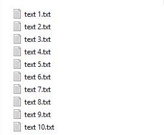
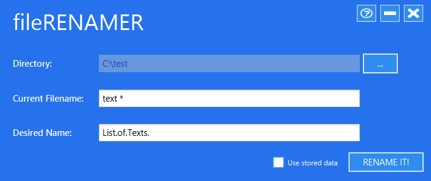
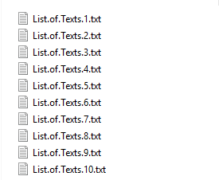

# FileRenamer
fileRenamer lets you rename all the files in a folder with an index and it detects if it is a serie and renames with the S00E00 format.

## Usage
```
1. Select the directory where the files to rename are with the "..." button.
2. On the second field of the app put the name of the one of the files with the token * this way:
  1. If the file is an ordinary file with an index just write the token "*" in the place of the index
  For example: javaguide1 fromXX.pdf -> javaguide*
  2. If the file is a serie with the S00E00 format just write the token "*" in the place of the "S"
  For example: Mr Robot s01e02.mkv -> Mr Robot *
3. Finally on the last field type the desired name to the files be renamed to
For example: javaguide1 fromXX.pdf -> javaguide* -> we type Java.Guide. the result will be:
                                                                                          Java.Guide.1.pdf
                                                                                          Java.Guide.2.pdf
                                                                                          Java.Guide.3.pdf
                                                                                          ...
Example2: Mr Robot s01e02.mkv -> Mr Robot * -> we type Mr.Robot. the result will be:
                                                                                Mr.Robot.S01E01.mkv
                                                                                Mr.Robot.S01E02.mkv
                                                                                Mr.Robot.S01E03.mkv
                                                                                ...
```

## Screenshots




